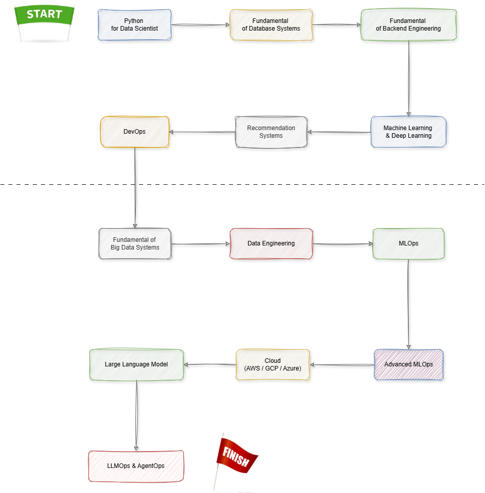
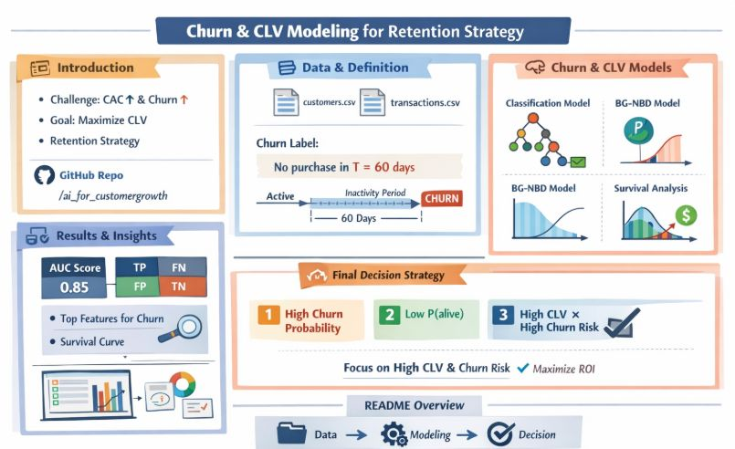
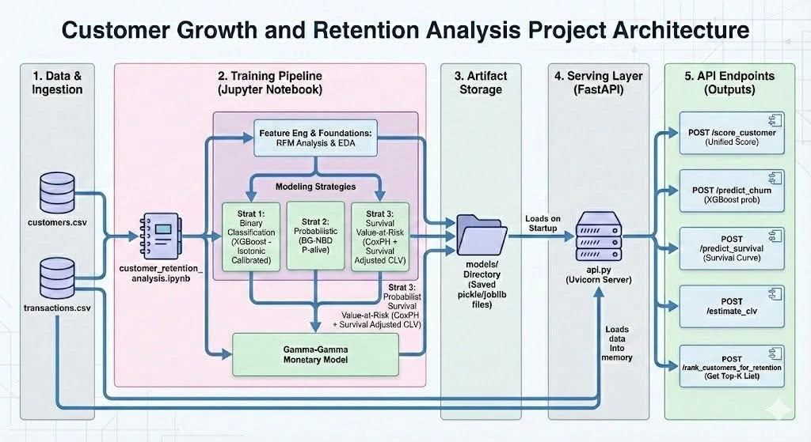

# Data Science & AI Course Materials

This repository contains roadmaps, teaching materials, and learning resources from the Data Science and AI courses I have taught and shared, including structured curricula and slides.

The goal of this repository is to provide:

- A clear learning roadmap for each topic
- Practical and industry-oriented content
- Reusable materials for self-study

> 🚀 **More slides, examples, and projects will be added in future updates. Stay tuned!**

## Table of Contents

- [Full Data Science Course (62 sessions)](#full-data-science-course-62-sessions)
- [AI Models for Customer Growth & Retention Bootcamp (6 sessions)](#ai-models-for-customer-growth--retention-bootcamp-6-sessions)
  - [Project](#project)
  - [Top 5 Student Projects](#top-5-student-projects)
- [Recommendation Systems Bootcamp (8 sessions)](#recommendation-systems-bootcamp-8-sessions)
- [Webinars & Public Talks](#webinars--public-talks)

## Full Data Science Course (62 sessions)

This section contains the roadmap and materials for the **Data Science course**, designed to guide learners from fundamentals to applied machine learning. The motivation behind this course is to:

- Bridge the gap between academic theory and real-world practice
- Provide a structured learning path for beginners and early-career practitioners
- Emphasize hands-on modeling, deployment, engineering and business-driven problem solving

Below is the roadmap I designed for this course:

  

<table style="width:100%; border-collapse: collapse;">
  <thead>
    <tr>
      <th style="border:1px solid #ccc; padding:8px;">Block</th>
      <th style="border:1px solid #ccc; padding:8px;">Topic</th>
      <th style="border:1px solid #ccc; padding:8px;">Content</th>
      <th style="border:1px solid #ccc; padding:8px;">Link</th>
    </tr>
  </thead>
  <tbody>
    <tr>
      <td style="border:1px solid #ccc; padding:8px;">1</td>
      <td style="border:1px solid #ccc; padding:8px;">Python for Data Scientist</td>
      <td style="border:1px solid #ccc; padding:8px;">
        - Pip vs. Conda vs. Uv 
        - Python List / NumPy / Pandas / Polars / PySpark 
        - Common pitfalls in data structures, vectorization & memory optimization 
        - Python vs. Cython vs. Rust 
        - Thread vs. process, concurrency vs. parallelism 
        - Reference counting, race condition, GIL & multithreading 
        - Multiprocessing, AsyncIO
      </td>
      <td style="border:1px solid #ccc; padding:8px;">
        <a href="https://docs.google.com/presentation/d/1ZE4uo6iQAWa8P7ENdv4kjfBQn-rJ2I_7/edit?usp=sharing&ouid=108196031463416657339&rtpof=true&sd=true" target="_blank">Slides</a>
      </td>
    </tr>
    <tr>
      <td style="border:1px solid #ccc; padding:8px;">2</td>
      <td style="border:1px solid #ccc; padding:8px;">Fundamentals of Database Systems</td>
      <td style="border:1px solid #ccc; padding:8px;">
        - SQL vs. NoSQL, Row-wise & Column-wise DB 
        - OLTP vs. OLAP 
        - ACID & BASE principles 
        - Data Warehouse, Data Mart 
        - Dimensional Modeling, Facts, Dimensions, Slowly Changing Dimensions (SCD) 
        - Normalization vs. Denormalization, Star Schema, Snowflake Schema 
        - Extract – Transform – Load (ETL), ELT 
        - Data Lake, Lakehouse 
        - Distributed Databases (HBase, Cassandra), CAP theorem
      </td>
      <td style="border:1px solid #ccc; padding:8px;">
        <a href="https://docs.google.com/presentation/d/12okO9_qU5THhITXxZHccKpwi512tOQ_8/edit?usp=sharing&ouid=108196031463416657339&rtpof=true&sd=true" target="_blank">Slides</a>
      </td>
    </tr>
    <tr>
      <td style="border:1px solid #ccc; padding:8px;">3</td>
      <td style="border:1px solid #ccc; padding:8px;">Fundamentals of Backend Engineering</td>
      <td style="border:1px solid #ccc; padding:8px;">
        - Web API fundamentals, URL with path & query parameters 
        - OSI model (7 layers), TCP & UDP, how HTTP & HTTPS work 
        - RESTful API, building APIs with Flask & FastAPI 
        - WSGI & ASGI (async/await), Werkzeug, Gunicorn, Uvicorn 
        - Encoding (Base64), Encryption (AES, RSA), Hashing (SHA256, bcrypt) 
        - API security: Authentication & Authorization (API Key, Basic Auth, JWT, OAuth2) 
        - RPC (Thrift, gRPC): connection pooling, multiplexing, streaming 
        - WebSocket, Webhook, Celery task
      </td>
      <td style="border:1px solid #ccc; padding:8px;">
        <a href="https://docs.google.com/presentation/d/1x_EN56luuGhzvC2ssP_94Qn0JFimMmZe/edit?usp=sharing&ouid=108196031463416657339&rtpof=true&sd=true" target="_blank">Slides</a>
      </td>
    </tr>
    <tr>
      <td style="border:1px solid #ccc; padding:8px;">4</td>
      <td style="border:1px solid #ccc; padding:8px;">Fundamentals of DevOps</td>
      <td style="border:1px solid #ccc; padding:8px;">
        - DevOps, software design 
        - Linux, Bash scripting 
        - Networking fundamentals 
        - Source control: Git, GitLab 
        - Containers, Docker 
        - Container orchestration: Kubernetes (K8s), Rancher 
        - CI/CD: GitLab CI, Jenkins 
        - Observability & monitoring: ELK, Prometheus, Grafana
      </td>
      <td style="border:1px solid #ccc; padding:8px;">
        <a href="https://docs.google.com/presentation/d/1HtM5VShwdKbRr9aQdV3depJrDqeuiiNLesZFlV3UvUw/edit?usp=sharing" target="_blank">Slides</a>
      </td>
    </tr>

  </tbody>  
</table>

## AI Models for Customer Growth & Retention Bootcamp (6 sessions)

<table style="width:100%; border-collapse: collapse;">
  <tr>
    <th style="border:1px solid #ccc; padding:8px;">Session</th>
    <th style="border:1px solid #ccc; padding:8px;">Content</th>
    <th style="border:1px solid #ccc; padding:8px;">Link</th>
  </tr>
  <tr>
    <td style="border:1px solid #ccc; padding:8px;">1</td>
    <td style="border:1px solid #ccc; padding:8px;">Customer Value Foundations: RFM & Customer Behavior Insights</td>
    <td style="border:1px solid #ccc; padding:8px;"><a href="https://docs.google.com/presentation/d/1kSXKW8Sr9UUkM0JBUdjF5LHX-Q59ZgJFe_IekjYoVy0/edit?usp=sharing">Slides</a></td>
  </tr>
  <tr>
    <td style="border:1px solid #ccc; padding:8px;">2</td>
    <td style="border:1px solid #ccc; padding:8px;">BG-NBD & Gamma–Gamma → Predictive CLV</td>
    <td style="border:1px solid #ccc; padding:8px;"><a href="https://docs.google.com/presentation/d/1H9cW1GqLP6JwUqKgQGTHaMvz4Mh-5MoAt1SxXlhzBTg/edit?usp=sharing">Slides</a></td>
  </tr>
  <tr>
    <td style="border:1px solid #ccc; padding:8px;">3</td>
    <td style="border:1px solid #ccc; padding:8px;">Churn Prediction as Classification Task</td>
    <td style="border:1px solid #ccc; padding:8px;"><a href="https://docs.google.com/presentation/d/1XijHtBVQDmjTnFZtYVQoMtgvDDpp8dlRoMjy4n7VB2k/edit?usp=sharing">Slides</a></td>
  </tr>
  <tr>
    <td style="border:1px solid #ccc; padding:8px;">4</td>
    <td style="border:1px solid #ccc; padding:8px;">Churn Prediction with Survival Analysis</td>
    <td style="border:1px solid #ccc; padding:8px;"><a href="https://docs.google.com/presentation/d/1fgRssSNyEKedpUGcHb6wgygor19Gx1Mi/edit?usp=sharing">Slides</a></td>
  </tr>
  <tr>
    <td style="border:1px solid #ccc; padding:8px;">5</td>
    <td style="border:1px solid #ccc; padding:8px;">Foundation of Causal Inference</td>
    <td style="border:1px solid #ccc; padding:8px;"><a href="https://docs.google.com/presentation/d/1SFGemM1IaoCAjY2glAVxn2DeNzsunDzNj3gkVl2jz1I/edit?usp=sharing">Slides</a></td>
  </tr>
  <tr>
    <td style="border:1px solid #ccc; padding:8px;">6</td>
    <td style="border:1px solid #ccc; padding:8px;">Causal Impact Estimation without Randomized Experiments</td>
    <td style="border:1px solid #ccc; padding:8px;"><a href="https://docs.google.com/presentation/d/1SFGemM1IaoCAjY2glAVxn2DeNzsunDzNj3gkVl2jz1I/edit?usp=sharing">Slides</a></td>
  </tr>
</table>

## Project

Description: _[Link](https://docs.google.com/document/d/1RoIq-vyM2Vo9jNc38i9W0mQyrPrlPLsYonQQbYnEZjU/edit?usp=sharing)_

  
  

## Top 5 Student Projects

<table style="width:100%; border-collapse: collapse;">
  <tr>
    <th style="border:1px solid #ccc; padding:8px;">Num</th>
    <th style="border:1px solid #ccc; padding:8px;">GitHub Student</th>
    <th style="border:1px solid #ccc; padding:8px;">GitHub Repository</th>
  </tr>
  <tr>
    <td style="border:1px solid #ccc; padding:8px;">1</td>
    <td style="border:1px solid #ccc; padding:8px;"><a href="https://github.com/DucDTran">DucDTran</a></td>
    <td style="border:1px solid #ccc; padding:8px;"><a href="https://github.com/DucDTran/customer-growth-retention?authuser=0">Repo</a></td>
  </tr>
  <tr>
    <td style="border:1px solid #ccc; padding:8px;">2</td>
    <td style="border:1px solid #ccc; padding:8px;"><a href="https://github.com/maithtruong">maithtruong</a></td>
    <td style="border:1px solid #ccc; padding:8px;"><a href="https://github.com/maithtruong/ai-customer-growth-retention/tree/exp?authuser=0">Repo</a></td>
  </tr>
  <tr>
    <td style="border:1px solid #ccc; padding:8px;">3</td>
    <td style="border:1px solid #ccc; padding:8px;"><a href="https://github.com/sonnguyen129">sonnguyen129</a></td>
    <td style="border:1px solid #ccc; padding:8px;"><a href="https://github.com/sonnguyen129/Final-Project-Bootcamp-AI4Customer-Growth?authuser=0">Repo</a></td>
  </tr>
  <tr>
    <td style="border:1px solid #ccc; padding:8px;">4</td>
    <td style="border:1px solid #ccc; padding:8px;"><a href="https://github.com/Solyda">Solyda</a></td>
    <td style="border:1px solid #ccc; padding:8px;"><a href="https://github.com/Solyda/customer-growth?authuser=0">Repo</a></td>
  </tr>
  <tr>
    <td style="border:1px solid #ccc; padding:8px;">5</td>
    <td style="border:1px solid #ccc; padding:8px;"><a href="https://github.com/trangq">trangq</a></td>
    <td style="border:1px solid #ccc; padding:8px;"><a href="https://github.com/trangq/ai_for_customergrowth?authuser=0">Repo</a></td>
  </tr>
</table>

## Recommendation Systems Bootcamp (8 sessions)

<table style="width:100%; border-collapse: collapse;">
  <tr>
    <th style="border:1px solid #ccc; padding:8px;">Session</th>
    <th style="border:1px solid #ccc; padding:8px;">Content</th>
    <th style="border:1px solid #ccc; padding:8px;">Link</th>
  </tr>
  <tr>
    <td style="border:1px solid #ccc; padding:8px;">1</td>
    <td style="border:1px solid #ccc; padding:8px;">Implicit Feedback, Data Sparsity & Evaluation</td>
    <td style="border:1px solid #ccc; padding:8px;">
      <a href="https://docs.google.com/presentation/d/1S0lW5cjbcnhGiPXTTw2LOSC0GEAcsbfxe0eCwkGdD6c/edit?usp=sharing">Slides</a>
    </td>
  </tr>
  <tr>
    <td style="border:1px solid #ccc; padding:8px;">2</td>
    <td style="border:1px solid #ccc; padding:8px;">ALS + BPR</td>
    <td style="border:1px solid #ccc; padding:8px;">
      <a href="https://docs.google.com/presentation/d/1_tBB1UuAeHDMBlBLud_-OQsYEeO9opMRtPXEEIbGbDE/edit?usp=sharing">Slides</a>
    </td>
  </tr>
  <tr>
    <td style="border:1px solid #ccc; padding:8px;">3</td>
    <td style="border:1px solid #ccc; padding:8px;">Word2vec / Item2vec + NeuMF</td>
    <td style="border:1px solid #ccc; padding:8px;">
      <a href="https://docs.google.com/presentation/d/1WX69jkE58m9o3m0Z_28g3mGNJQWiDsuevChxQYsHzjE/edit?usp=sharing">Slides</a>
    </td>
  </tr>
  <tr>
    <td style="border:1px solid #ccc; padding:8px;">4</td>
    <td style="border:1px solid #ccc; padding:8px;">Two-Tower + Deep FM Family</td>
    <td style="border:1px solid #ccc; padding:8px;">
      <a href="https://docs.google.com/presentation/d/1ANmGWyAErvLV-urstOTMzOUH3OVK2TFAZKKFO_L1MXs/edit?usp=sharing">Slides</a>
    </td>
  </tr>
  <tr>
    <td style="border:1px solid #ccc; padding:8px;">5</td>
    <td style="border:1px solid #ccc; padding:8px;">Graph-based RecSys: metapath2vec + GraphSAGE</td>
    <td style="border:1px solid #ccc; padding:8px;">
      <a href="https://docs.google.com/presentation/d/1NNqyytcciAJyrnY9Lq5nWQCuoSMxKrML4MkIQNhOjT8/edit?usp=sharing">Slides</a>
    </td>
  </tr>
  <tr>
    <td style="border:1px solid #ccc; padding:8px;">6</td>
    <td style="border:1px solid #ccc; padding:8px;">Sequential Models with BERT4Rec</td>
    <td style="border:1px solid #ccc; padding:8px;">
      <a href="https://docs.google.com/presentation/d/18mALojnJDij8ivYLskFlIrvdJ8XlefeAuHrygFeObkw/edit?usp=sharing">Slides</a>
    </td>
  </tr>
  <tr>
    <td style="border:1px solid #ccc; padding:8px;">7</td>
    <td style="border:1px solid #ccc; padding:8px;">Multi-Armed Bandit / Contextual Bandit / Clustered Bandit</td>
    <td style="border:1px solid #ccc; padding:8px;">
      <a href="https://docs.google.com/presentation/d/18mALojnJDij8ivYLskFlIrvdJ8XlefeAuHrygFeObkw/edit?usp=sharing">Slides</a>
    </td>
  </tr>
  <tr>
    <td style="border:1px solid #ccc; padding:8px;">8</td>
    <td style="border:1px solid #ccc; padding:8px;">LLM for RecSys</td>
    <td style="border:1px solid #ccc; padding:8px;">
      <a href="https://docs.google.com/presentation/d/14f0zwKZFOFNkWAWxReGDuzYDaP68G9ESsl2__JY79xc/edit?usp=sharing">Slides</a>
    </td>
  </tr>
</table>

## Webinars & Public Talks

<table style="width:100%; border-collapse: collapse;">
  <tr>
    <th style="border:1px solid #ccc; padding:8px;">Date</th>
    <th style="border:1px solid #ccc; padding:8px;">Topic</th>
    <th style="border:1px solid #ccc; padding:8px;">Link</th>
  </tr>
  <tr>
    <td style="border:1px solid #ccc; padding:8px;">11/08/2025</td>
    <td style="border:1px solid #ccc; padding:8px;">Data Science & AI Trend</td>
    <td style="border:1px solid #ccc; padding:8px;">
      <a href="https://docs.google.com/presentation/d/1lhYmVG47Bnc0716Kq8_GJ7MjEjcgFaFRdPSnp0aAu1E/edit?usp=sharing">Webinar Slides</a>
    </td>
  </tr>
  <tr>
    <td style="border:1px solid #ccc; padding:8px;">01/12/2025</td>
    <td style="border:1px solid #ccc; padding:8px;">Rethinking Personalization in Fintech/Banking with AI Agents</td>
    <td style="border:1px solid #ccc; padding:8px;">
      <a href="https://docs.google.com/presentation/d/1zSEzNx1m6q3O3283cbTyCWIPGZF7376KuM029gCnXsM/edit?usp=sharing">Webinar Slides</a>
    </td>
  </tr>
  <tr>
    <td style="border:1px solid #ccc; padding:8px;">12/12/2025</td>
    <td style="border:1px solid #ccc; padding:8px;">Recommendation Systems, From Foundation to Frontiers</td>
    <td style="border:1px solid #ccc; padding:8px;">
      <a href="https://docs.google.com/presentation/d/1BTLrQEBzN7oRa8AKEatL3h-H8hQdILxitC5D1jhLuUk/edit?usp=sharing">Webniar Slides</a>
    </td>
  </tr>
  <tr>
    <td style="border:1px solid #ccc; padding:8px;">25/12/2025</td>
    <td style="border:1px solid #ccc; padding:8px;">From Tools to Agents: The Business Explosion of the AI Economy</td>
    <td style="border:1px solid #ccc; padding:8px;">
      <a href="https://www.linkedin.com/posts/h%C3%B2a-l%C3%AA-9a2795167_honored-to-be-invited-to-this-offline-seminar-activity-7408092101797847041-E6Gn?utm_source=share&utm_medium=member_desktop&rcm=ACoAACfOBEoBY0GB2D0E2tpi4wCRDaFiVhVUr_M">Offline at Vin University</a>
    </td>
  </tr>
  <tr>
    <td style="border:1px solid #ccc; padding:8px;">06/03/2026</td>
    <td style="border:1px solid #ccc; padding:8px;">AI Agents for Banking</td>
    <td style="border:1px solid #ccc; padding:8px;">
      <a href="">Offline at Foreign Trade University</a>
    </td>
  </tr>
</table>
